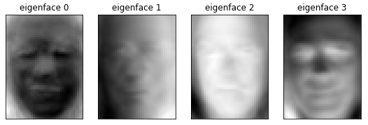
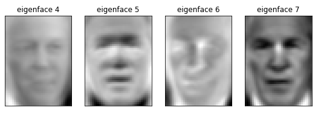
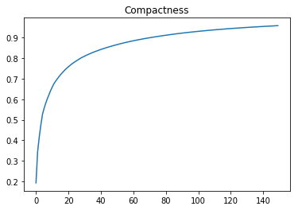

# Requirements:
  * Keras
  * Numpy

# Principal-Component-Analysis
Dimensionality Reduction using PCA and building a Random Forest classifier to do the classification on Labelled Face (LFW) dataset

**There are a total of 7 labels/classes corresponding to the images at hand, for the prediction**
**I am choosing top 150 dimensions with the highest variance**

**Some of the Eigen faces are:**

  
  

**Compactness Plot for evaluating the performance of dimensionality reduction**

  
